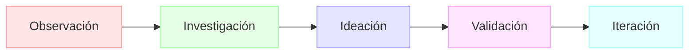
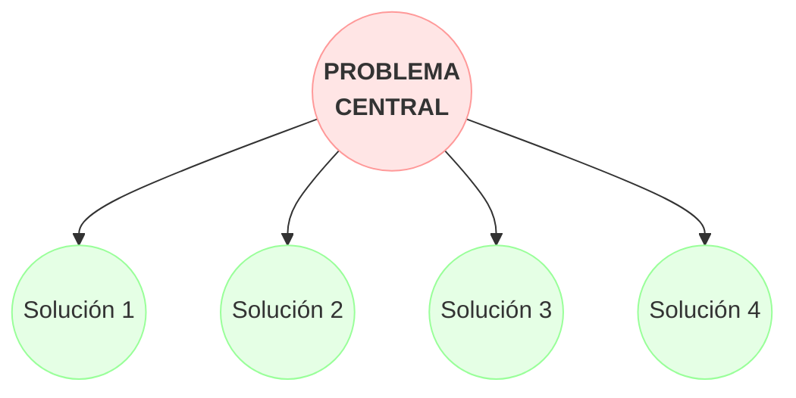

# 1.1. Cómo Encontrar una Idea de Negocio Innovadora

Encontrar la idea adecuada es el primer gran paso en tu viaje como emprendedor. No se trata de tener una revelación divina, sino de un proceso de observación, investigación y creatividad.

## El Proceso de Ideación



## Fuentes de Inspiración

1.  **Resuelve un problema propio:** 
Muchas de las startups más exitosas nacieron de fundadores que crearon una solución a un problema que ellos mismos experimentaban.

    **Ejemplo:** Dropbox surgió cuando Drew Houston se cansó de olvidar su memoria USB. Creó un servicio de almacenamiento en la nube que sincronizaba automáticamente los archivos entre dispositivos.

2.  **Observa tu entorno:** 
Presta atención a las ineficiencias o necesidades no cubiertas en tu trabajo, tu comunidad o en las industrias que conoces.

    **Ejemplo:** Airbnb nació cuando sus fundadores notaron que los hoteles en San Francisco estaban llenos durante una conferencia y decidieron rentar colchones de aire en su apartamento.

3.  **Analiza tendencias del mercado:** 
Investiga las tendencias tecnológicas, sociales y económicas emergentes.

    **Herramientas útiles:**
    - Google Trends
    - Informes de consultoras (Gartner, Forrester)
    - Redes sociales y hashtags trending
    - Newsletters especializadas
    - Podcasts de tecnología y negocios

    **Ejemplo de análisis de tendencia:**
    ```
    Tendencia: Trabajo Remoto
    ↓
    Problemas identificados:
    - Comunicación asíncrona
    - Gestión de equipos virtuales
    - Cultura empresarial remota
    ↓
    Oportunidades de negocio:
    - Herramientas de colaboración
    - Plataformas de team building virtual
    - Software de seguimiento de productividad
    ```

4.  **Busca industrias obsoletas:** 
Identifica sectores que no han innovado en años.

    **Sectores con potencial de disrupción:**
    - Sector inmobiliario
    - Educación tradicional
    - Servicios legales
    - Agricultura
    - Construcción

    **Ejemplo:** DocuSign revolucionó la firma de documentos legales al llevar un proceso tradicionalmente físico al mundo digital.

5.  **Adapta un modelo de negocio exitoso:** 
Analiza modelos que funcionan en otros mercados.

    **Matriz de adaptación:**
    ```
    Modelo Original → Adaptaciones Posibles
    Uber (transporte) → Delivery de comida
                    → Servicios a domicilio
                    → Logística última milla
    ```

## Técnicas de Ideación

### 1. Brainstorming Estructurado
**¿Qué es?**
Es una técnica grupal que busca generar una gran cantidad de ideas en un ambiente estructurado y sin juicios. A diferencia del brainstorming tradicional, sigue un proceso definido que ayuda a mantener el enfoque y maximizar la productividad del grupo.

**¿Cuándo usarla?**
- Al inicio de un proyecto cuando necesitas generar múltiples ideas
- Cuando tienes un equipo diverso con diferentes perspectivas
- Para resolver problemas específicos que requieren soluciones creativas
- Cuando buscas innovar en un producto o servicio existente



El proceso sigue estas etapas:

1. **Preparación (15-20 min)**
   - Define el problema específico
   - Establece reglas básicas (no críticas, cantidad sobre calidad)
   - Prepara materiales (post-its, pizarra)

2. **Generación de Ideas (20-30 min)**
   - Cada participante escribe ideas individualmente
   - Una idea por post-it
   - Sin juzgar ni filtrar

3. **Agrupación (15-20 min)**
   - Organiza ideas por categorías
   - Identifica patrones y conexiones
   - Crea clusters temáticos

4. **Evaluación (20-30 min)**
   - Vota las mejores ideas
   - Discute la viabilidad
   - Selecciona top 3-5 ideas para desarrollar

**Ejemplo Práctico:**
Problema: "Mejorar la experiencia de compra en supermercados"

```
Cluster 1: Tecnología
- App de navegación en tienda
- Carrito inteligente
- Checkout automático

Cluster 2: Conveniencia
- Servicio de empaque personalizado
- Pickup points en la ciudad
- Suscripción de productos básicos

Cluster 3: Experiencia
- Degustaciones personalizadas
- Asesor de compras virtual
- Recetas basadas en compras
```

### 2. Método SCAMPER
**¿Qué es?**
SCAMPER es una técnica de pensamiento lateral que utiliza un conjunto de preguntas dirigidas para modificar o mejorar algo existente. Es especialmente útil cuando ya tienes un producto o servicio base y buscas formas de innovar sobre él.

**¿Cuándo usarlo?**
- Para mejorar productos o servicios existentes
- Cuando buscas diferenciarte de la competencia
- Para encontrar nuevos nichos de mercado
- Para resolver problemas de manera creativa

Una técnica sistemática para transformar productos o servicios existentes:

- **S**ustituir
  - *Pregunta:* ¿Qué puedes reemplazar?
  - *Ejemplo:* Netflix sustituyó DVDs físicos por streaming
  - *Ejercicio:* Identifica 3 elementos de tu producto/servicio que podrían ser reemplazados

- **C**ombinar
  - *Pregunta:* ¿Qué elementos puedes unir?
  - *Ejemplo:* Uber Eats combinó ride-sharing con delivery de comida
  - *Ejercicio:* Lista 2 servicios exitosos que podrían combinarse

- **A**daptar
  - *Pregunta:* ¿Qué puedes modificar?
  - *Ejemplo:* Airbnb adaptó el concepto de hotel a hogares privados
  - *Ejercicio:* Adapta un modelo de negocio exitoso a un nuevo mercado

- **M**odificar
  - *Pregunta:* ¿Qué puedes magnificar o minimizar?
  - *Ejemplo:* Mini Cooper modificó el tamaño tradicional del auto
  - *Ejercicio:* Identifica características que podrían ser exageradas o minimizadas

- **P**roponer
  - *Pregunta:* ¿Qué otros usos puede tener?
  - *Ejemplo:* Post-it surgió de un adhesivo "fallido"
  - *Ejercicio:* Encuentra 3 usos alternativos para tu producto

- **E**liminar
  - *Pregunta:* ¿Qué puedes simplificar?
  - *Ejemplo:* Apple eliminó el teclado físico en el iPhone
  - *Ejercicio:* Lista características que podrían eliminarse

- **R**eordenar
  - *Pregunta:* ¿Qué orden alternativo funcionaría mejor?
  - *Ejemplo:* Dell reordenó la cadena de suministro (directo al consumidor)
  - *Ejercicio:* Dibuja tu proceso actual y reorganízalo

### 3. Design Thinking
**¿Qué es?**
Es una metodología centrada en el usuario que combina empatía, creatividad y racionalidad para satisfacer las necesidades del usuario y crear soluciones viables de negocio. Se diferencia de otros métodos por su fuerte énfasis en la comprensión profunda del usuario antes de proponer soluciones.

**¿Cuándo usarlo?**
- Cuando necesitas entender profundamente las necesidades del usuario
- Para problemas complejos que requieren soluciones innovadoras
- Cuando quieres validar ideas rápidamente con usuarios reales
- Para proyectos que requieren múltiples iteraciones

Un enfoque centrado en el usuario para la innovación:

1. **Empatizar**
   - Entrevistas con usuarios
   - Observación directa
   - Inmersión en el contexto

2. **Definir**
   - Crear personas (user personas)
   - Mapear puntos de dolor
   - Definir el problema central

3. **Idear**
   - Sesiones de brainstorming
   - Sketching de soluciones
   - Prototipado rápido

4. **Prototipar**
   - Mockups de baja fidelidad
   - Prototipos funcionales
   - Simulaciones

5. **Testear**
   - Pruebas de usuario
   - Feedback iterativo
   - Refinamiento

**Ejemplo de Design Thinking:**
Proyecto: App de Fitness en Casa

```
Empatizar:
- Entrevistas con 20 usuarios
- Observación de rutinas de ejercicio
- Análisis de apps existentes

Definir:
- Persona: "Ana, 30 años, profesional ocupada"
- Problema: "Quiero mantenerme en forma pero no tengo tiempo para ir al gimnasio"

Idear:
- Workouts cortos (15-20 min)
- Ejercicios sin equipo
- Gamificación y retos

Prototipar:
- Wireframes de la app
- Videos de ejemplo
- Sistema de progresión

Testear:
- Beta con 50 usuarios
- Métricas de engagement
- Iteraciones basadas en feedback
```

### 4. Mapa de Oportunidades
**¿Qué es?**
Es una herramienta visual que ayuda a identificar espacios de innovación mediante el análisis de diferentes dimensiones del mercado. Permite descubrir oportunidades no evidentes al examinar las intersecciones entre diferentes variables del negocio.

**¿Cuándo usarlo?**
- Para identificar nichos de mercado no atendidos
- Cuando buscas diversificar tu oferta de productos/servicios
- Para encontrar nuevas oportunidades en mercados saturados
- Al planear la expansión estratégica de tu negocio

Una técnica visual para identificar espacios de innovación:

1. **Identificar Dimensiones**
   - Mercado/Segmentos
   - Necesidades/Deseos
   - Tecnologías/Capacidades

2. **Mapear el Presente**
   - Soluciones actuales
   - Competidores
   - Tendencias emergentes

3. **Visualizar Gaps**
   - Necesidades no cubiertas
   - Segmentos desatendidos
   - Tecnologías subutilizadas

4. **Generar Oportunidades**
   - Cruces entre dimensiones
   - Nuevas combinaciones
   - Espacios vacíos

**Ejemplo de Mapa de Oportunidades:**
Sector: Educación Online

```
Segmentos × Necesidades:
- Profesionales → Microlearning
- Estudiantes → Aprendizaje social
- Seniors → Tecnología accesible

Necesidades × Tecnología:
- Personalización → AI/ML
- Interacción → VR/AR
- Certificación → Blockchain

Oportunidades Identificadas:
1. Plataforma VR para práctica de habilidades
2. Sistema AI de tutoría personalizada
3. Certificaciones verificables en blockchain
```

## Evaluación Inicial de Ideas

Antes de profundizar en la validación formal, evalúa tus ideas con estas preguntas:

1. ¿Resuelve un problema real y específico?
2. ¿Existe un mercado potencial significativo?
3. ¿Tienes las capacidades necesarias o puedes adquirirlas?
4. ¿Es técnicamente viable con la tecnología actual?
5. ¿El momento del mercado es el adecuado?

## Errores Comunes a Evitar

1. **Enamorarse de la solución en lugar del problema**
   - ❌ "Mi app revolucionará la industria"
   - ✅ "Este problema afecta a X personas y necesita una solución"

2. **Buscar una idea 100% original**
   - ❌ "Ya existe algo similar, mejor busco otra cosa"
   - ✅ "Puedo hacerlo mejor o diferente para este mercado"

3. **Mantener la idea en secreto**
   - ❌ "No quiero que me roben la idea"
   - ✅ "Necesito feedback para mejorar el concepto"

## Glosario de Términos Técnicos

- **Startup:** Empresa emergente que busca un modelo de negocio escalable y repetible.

- **Disrupción:** Innovación que crea un nuevo mercado y desestabiliza a los competidores existentes.

- **MVP (Minimum Viable Product):** Versión básica de un producto que permite validar hipótesis con el mínimo esfuerzo.

- **Pivot:** Cambio estratégico en el modelo de negocio basado en el aprendizaje del mercado.

- **Early Adopters:** Primeros usuarios que adoptan un producto nuevo y proporcionan feedback valioso.

- **Product-Market Fit:** Cuando un producto satisface una necesidad real del mercado de manera efectiva.

- **Escalabilidad:** Capacidad de un negocio para crecer sin que aumenten proporcionalmente sus costos.

- **TAM (Total Addressable Market):** Tamaño total del mercado potencial para un producto.

## Próximos Pasos

Una vez que tengas una o varias ideas, el siguiente paso es validarlas. No te enamores de tu primera idea sin antes investigar si realmente hay un mercado para ella. Esto lo veremos en el siguiente capítulo sobre **Investigación de mercado y análisis de la competencia**.

---

💡 **Consejo final:** Mantén un "diario de ideas" donde anotes cualquier problema o oportunidad que observes en tu día a día. Las mejores ideas suelen surgir de la observación constante y la reflexión regular sobre los problemas cotidianos.