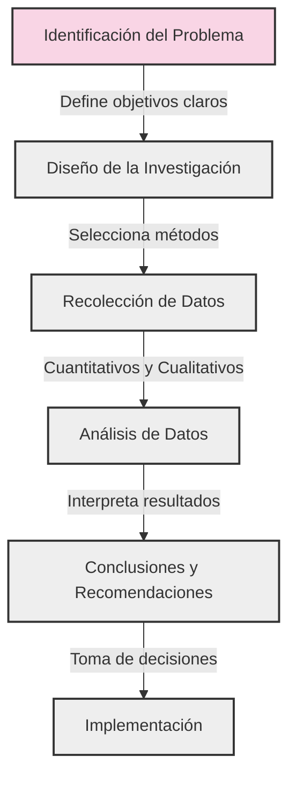
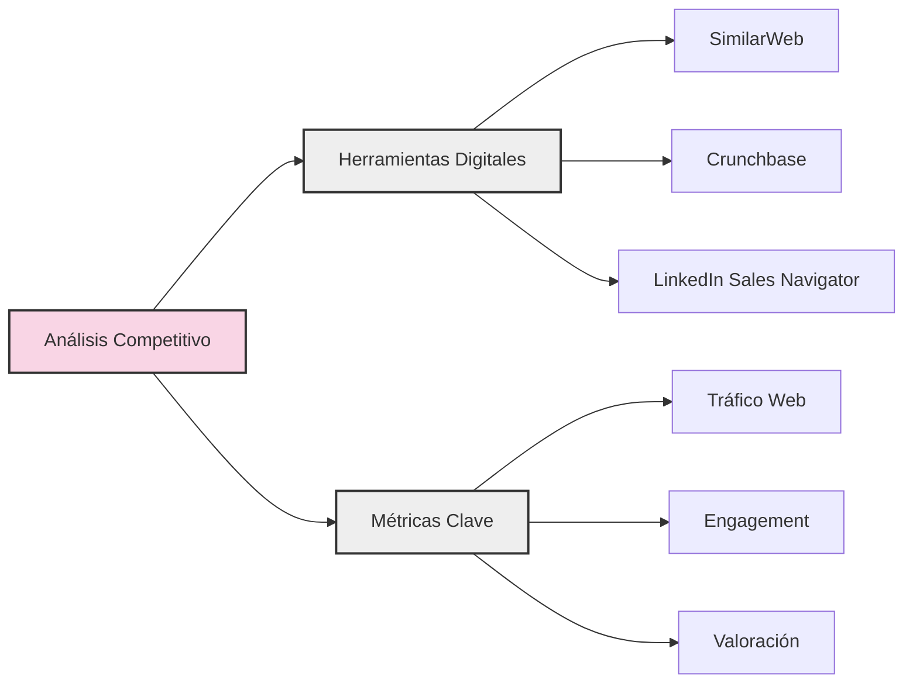

# 1.2. Investigación de Mercado y Análisis de la Competencia

Una idea, por muy brillante que parezca, no vale nada si no hay un mercado dispuesto a pagar por ella. La investigación de mercado es el proceso sistemático que te permite entender a tus potenciales clientes, validar tus hipótesis y determinar si tu idea tiene potencial real de convertirse en un negocio exitoso.

## El Proceso de Investigación de Mercado

La investigación de mercado es un viaje de descubrimiento que sigue un proceso estructurado:

### Elementos Clave del Proceso

1. **Identificación del Problema**
   - Define claramente qué necesitas saber
   - Establece objetivos medibles
   - Identifica las preguntas clave a responder

2. **Diseño de la Investigación**
   - Selecciona metodologías apropiadas
   - Define tu muestra objetivo
   - Planifica recursos y timeline

3. **Recolección de Datos**
   - Implementa herramientas de investigación
   - Asegura la calidad de los datos
   - Documenta el proceso

4. **Análisis de Datos**
   - Procesa la información recolectada
   - Identifica patrones y tendencias
   - Valida hipótesis iniciales

5. **Conclusiones**
   - Sintetiza los hallazgos clave
   - Formula recomendaciones
   - Prepara el plan de acción

## ¿Por Dónde Empezar?

### 1. Define tu público objetivo (Target Audience)

**¿Qué es?**
Es el proceso de identificar y caracterizar al grupo específico de personas que más probablemente comprarán tu producto o servicio.

**¿Cuándo usarlo?**
Al inicio de tu investigación de mercado, antes de profundizar en otros aspectos. Es fundamental para enfocar todos tus esfuerzos posteriores.

**Pasos clave:**
1. Segmenta el mercado por criterios:
   - Demográficos (edad, género, ingresos)
   - Geográficos (ubicación, clima, cultura)
   - Psicográficos (estilo de vida, valores, intereses)
   - Conductuales (patrones de uso, lealtad de marca)

2. Crea tu Buyer Persona:
   - Nombre y foto (para hacerlo más real)
   - Datos demográficos básicos
   - Antecedentes profesionales
   - Objetivos y retos
   - Hábitos de consumo
   - Canales de comunicación preferidos

### 2. Analiza el tamaño del mercado

**¿Qué es?**
Es la cuantificación del número total de potenciales clientes y el valor monetario que representa.

**¿Cuándo usarlo?**
Después de definir tu público objetivo y antes de realizar inversiones significativas.

**Métricas clave:**
1. TAM (Total Addressable Market)
   - Mercado total disponible
   - Ejemplo: Todas las personas que usan smartphones

2. SAM (Serviceable Addressable Market)
   - Mercado que puedes servir con tu modelo de negocio
   - Ejemplo: Usuarios de smartphones en tu país

3. SOM (Serviceable Obtainable Market)
   - Mercado que puedes capturar realistamente
   - Ejemplo: 5% de los usuarios de smartphones en tu ciudad

### 3. Habla con tus potenciales clientes

**¿Qué es?**
Es la validación directa de tus hipótesis a través de interacciones con tu mercado objetivo.

**¿Cuándo usarlo?**
Constantemente durante todo el proceso de desarrollo de tu startup.

**Metodologías efectivas:**
1. Entrevistas uno a uno
   - Prepara un guión semi-estructurado
   - Haz preguntas abiertas
   - Escucha más que hablas

2. Encuestas online
   - Usa herramientas como Google Forms o Typeform
   - Combina preguntas cualitativas y cuantitativas
   - Mantén la encuesta corta (5-10 minutos)

3. Focus Groups
   - Reúne 6-8 personas de tu público objetivo
   - Modera la discusión sin influenciar
   - Graba la sesión para análisis posterior

## Análisis de la Competencia

Es muy probable que ya existan otras empresas intentando solucionar el mismo problema. Analizar a tu competencia te permitirá diferenciarte y encontrar tu hueco en el mercado.

### 1. Identifica a tus competidores

**¿Qué es?**
Es el proceso de mapear el ecosistema competitivo en el que operará tu startup.

**¿Cuándo usarlo?**
Al inicio de tu investigación y actualizarlo periódicamente.

**Tipos de competidores:**
*   **Competidores directos:** Ofrecen una solución muy similar a la tuya al mismo público.
    - Ejemplo: Uber vs Lyft
    - Analiza: Precios, características, UX, marketing

*   **Competidores indirectos:** Ofrecen soluciones diferentes pero que satisfacen la misma necesidad.
    - Ejemplo: Uber vs Taxi tradicional
    - Analiza: Ventajas y desventajas de cada solución

*   **Competidores potenciales:** Empresas que podrían entrar en tu mercado en el futuro.
    - Ejemplo: Grandes tecnológicas, startups bien financiadas
    - Analiza: Barreras de entrada, recursos necesarios

### 2. Analiza a tus competidores

**¿Qué es?**
Es la evaluación detallada de las fortalezas y debilidades de cada competidor relevante.

**¿Cuándo usarlo?**
Después de identificar a tus competidores principales y antes de definir tu estrategia de diferenciación.

**Aspectos a analizar:**
1. Producto/Servicio
   - Características y funcionalidades
   - Calidad y rendimiento
   - Experiencia de usuario

2. Precio y Modelo de Negocio
   - Estructura de precios
   - Estrategia de monetización
   - Costos operativos

3. Marketing y Ventas
   - Canales de distribución
   - Estrategias de comunicación
   - Base de clientes actual

4. Análisis DAFO
   - **Debilidades:** Aspectos internos negativos
   - **Amenazas:** Factores externos negativos
   - **Fortalezas:** Aspectos internos positivos
   - **Oportunidades:** Factores externos positivos

### 3. Encuentra tu diferenciación

**¿Qué es?**
Es la identificación y desarrollo de los elementos que harán único y valioso tu producto o servicio.

**¿Cuándo usarlo?**
Después de comprender profundamente el mercado y la competencia.

**Estrategias de diferenciación:**
1. Innovación tecnológica
   - Patentes y propiedad intelectual
   - Características únicas
   - Mejor rendimiento

2. Experiencia de usuario
   - Diseño superior
   - Mejor servicio al cliente
   - Mayor personalización

3. Precio y valor
   - Mejor relación calidad-precio
   - Modelo de negocio innovador
   - Eficiencia operativa

## Herramientas y Recursos

### 1. Herramientas de Investigación de Mercado

Las herramientas adecuadas pueden hacer la diferencia entre una investigación superficial y una profunda comprensión del mercado.

#### Investigación Primaria
- **Herramientas de Encuestas**
  - SurveyMonkey: Creación de encuestas profesionales
  - Google Forms: Opción gratuita y versátil
  - Typeform: Encuestas interactivas y atractivas

- **Análisis de Datos**
  - Tableau: Visualización de datos avanzada
  - Google Analytics: Comportamiento de usuarios online
  - Mixpanel: Análisis de producto y usuario

#### Investigación Secundaria
- **Tendencias y Mercado**
  - Google Trends: Tendencias de búsqueda
  - SEMrush: Análisis de mercado digital
  - Statista: Estadísticas y estudios de mercado

### 2. Herramientas de Análisis Competitivo

#### Herramientas Específicas
- **SimilarWeb**
  - Análisis de tráfico web
  - Fuentes de tráfico
  - Estrategias de marketing

- **Crunchbase**
  - Información de financiación
  - Estructura corporativa
  - Adquisiciones y partnerships

- **LinkedIn Sales Navigator**
  - Análisis de empleados
  - Crecimiento de la empresa
  - Cambios organizacionales

## Errores Comunes y Cómo Evitarlos

### 1. Sesgo de Confirmación

**Descripción:**
Tendencia a buscar y favorecer información que confirme nuestras creencias preexistentes.

**Cómo evitarlo:**
- Busca activamente evidencia contradictoria
- Involucra a personas con diferentes perspectivas
- Documenta tanto el feedback positivo como el negativo

### 2. Análisis Parálisis

**Descripción:**
Quedarse estancado en la fase de investigación sin pasar a la acción.

**Cómo evitarlo:**
- Establece plazos claros para cada fase
- Define criterios de decisión anticipadamente
- Implementa ciclos cortos de investigación-acción

### 3. Muestra Sesgada

**Descripción:**
Obtener feedback principalmente de un grupo no representativo del mercado objetivo.

**Cómo evitarlo:**
- Define criterios claros de selección de muestra
- Utiliza múltiples canales de reclutamiento
- Valida la representatividad de tu muestra

### 4. Ignorar la Competencia Indirecta

**Descripción:**
Enfocarse solo en competidores obvios, perdiendo de vista soluciones alternativas.

**Cómo evitarlo:**
- Mapea todas las formas de resolver el problema
- Analiza industrias adyacentes
- Considera soluciones no tecnológicas

### 5. Sobreestimar el Mercado

**Descripción:**
Proyectar números optimistas sin considerar limitaciones reales.

**Cómo evitarlo:**
- Utiliza múltiples fuentes de datos
- Aplica factores de corrección conservadores
- Valida estimaciones con expertos del sector

## Glosario de Términos

### Términos Básicos
- **Buyer Persona:** Representación semi-ficticia de tu cliente ideal basada en datos reales y especulaciones informadas sobre demografía, comportamiento, motivaciones y desafíos.

- **TAM (Total Addressable Market):** El tamaño total del mercado disponible para tu producto o servicio si alcanzaras el 100% de cuota de mercado.

- **SAM (Serviceable Addressable Market):** La porción del TAM que puedes servir con tu modelo de negocio y alcance geográfico actual.

- **SOM (Serviceable Obtainable Market):** La parte del SAM que puedes capturar de manera realista en el corto-medio plazo.

### Términos de Investigación
- **Focus Group:** Método de investigación cualitativa que implica una discusión interactiva y moderada con un grupo pequeño de personas.

- **Investigación Primaria:** Recolección de datos originales directamente de las fuentes (encuestas, entrevistas, observaciones).

- **Investigación Secundaria:** Análisis de datos existentes recopilados por otros (informes de mercado, estadísticas gubernamentales).

### Términos de Análisis
- **Análisis DAFO:** Herramienta de planificación estratégica que evalúa factores internos (Debilidades y Fortalezas) y externos (Amenazas y Oportunidades).

- **Propuesta Única de Valor (UVP):** Declaración clara del beneficio específico que ofreces, cómo resuelves las necesidades del cliente y qué te distingue de la competencia.

- **Early Adopters:** Primeros usuarios que están dispuestos a probar tu producto en sus etapas iniciales, tolerando imperfecciones a cambio de ser los primeros en beneficiarse de la solución.

- **Cuota de Mercado:** Porcentaje del mercado total que una empresa captura en términos de ventas o usuarios.

- **Segmentación de Mercado:** División del mercado total en grupos más pequeños y manejables basados en características comunes.