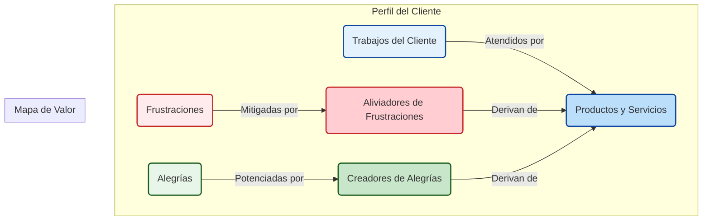

# 🎯 1.3. Definiendo tu Propuesta Única de Valor (PUV)

Tu Propuesta Única de Valor (PUV) es una declaración clara y concisa que explica por qué un cliente debería elegir tu producto o servicio en lugar del de la competencia. Es el corazón de tu ventaja competitiva y el pilar sobre el que se construye tu estrategia de marketing y ventas.

## 🤔 ¿Qué NO es una Propuesta de Valor?

Es fácil confundir una PUV con otros elementos de marketing. Aclaremos las diferencias:

*   **No es un eslogan:** Un eslogan es una frase pegadiza para una campaña publicitaria (ej: "Just Do It" de Nike). La PUV es más descriptiva y estratégica.
*   **No es una declaración de posicionamiento:** Una declaración de posicionamiento define tu lugar en el mercado (ej: "El coche eléctrico de lujo más seguro"). La PUV se centra en el valor directo para el cliente.

## ✨ Elementos Clave de una Buena PUV

Una PUV efectiva debe ser clara, concisa y fácil de entender en menos de 5 segundos. Debe comunicar tres cosas fundamentales:

1.  **Relevancia:** ¿Cómo tu producto soluciona los problemas o mejora la vida de tus clientes? Debe conectar directamente con una necesidad o deseo del cliente.
2.  **Valor Cuantificable:** ¿Qué beneficios específicos y medibles ofrece? (Ej: "Ahorra un 50% en tiempo de gestión", "Reduce los costes operativos en 20%").
3.  **Diferenciación Única:** ¿Por qué deberían comprarte a ti y no a la competencia? Debe destacar lo que te hace único y superior.

## 🛠️ Cómo Construir tu Propuesta de Valor: El Canvas

El "Value Proposition Canvas" de Alex Osterwalder es una herramienta visual excelente para diseñar y validar tu PUV. Se divide en dos partes: el Perfil del Cliente y el Mapa de Valor.

### Pasos para usar el Canvas:

1.  **Perfil del Cliente (Círculo):**
    *   **Trabajos del Cliente:** ¿Qué tareas funcionales, sociales o emocionales intentan resolver tus clientes? (Ej: *Gestionar un proyecto*).
    *   **Frustraciones:** ¿Qué les molesta o les impide hacer esos trabajos? (Ej: *Pérdida de información en emails*).
    *   **